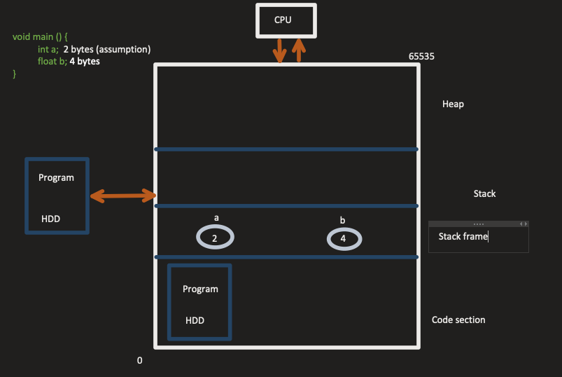

# Memory
Memory is linear 

RAM, when speaking of sizes like 16GB or 32GB, is divided into segments

## Static vs Dynamic memory

Static memory allocation - how many bytes of memory is required by a program is decided at compile time



```c
void fun2(int i) {
    int a;
}

void fun1 () {
    int x;
    fun2(x);
}

void main () {
    int a;
    float b;

    fun1()

    return 0;
}

```
Each function call creates a new <b>stack frame</b>. In this case, the main function creates a stack frame where it stores the variable `a` and `b`. After that a new stack frame is inserted at the top of the stack for `fun1` where it stores variable `x`. When a function reaches the end of the execution it `pops` the stack frame from the top of the stack.  

Stack memory is very organised. The heap memory can be considered unorganised and a <b>resource</b>. Memory can be requested but must also be released. Programs cannot access heap memory <b>directly</b>. That is why we need <b>pointers</b>. Pointers are generally the size of an integer.

```c
void main () {
    int *p; // 2 bytes 

    /* (C++) declare a pointer to beginning of array */
    p = new int[5]; 
    
    /* (C) declare a pointer to beginning of array */
    p = (int*) malloc(2 * 5)

    /* free memory */
    delete []p;

    return 0;
}
```

When not in use, memory should be released. If not, this can cause <b>memory leakage</b>, and at one point, the heap becomes full if your program continues to not free the memory.

## Types of Data Structures

### Physical 

#### Array
Continguous memory locations

Fixed size (static)

#### Linked List
Linked list is always created in the heap

Variable length (dynamic)

### Logical 
To implement logical data structures physical data structures are used
#### Stack (Linear) LIFO
#### Queues (Linear) FIFO
#### Trees (Non-linear) 
#### Graph (Non-linear)
#### Hash Table (Tabular)

### Abstract Data Type
1. representation of data
2. operation on data

<b>Integer</b> 

`int x; // 2 bytes`

16 bits where first bit is used to sign the number

Operations allowed: + - / * % ++ --

Operation implementation is <b>abstract</b>

## Time Complexity
